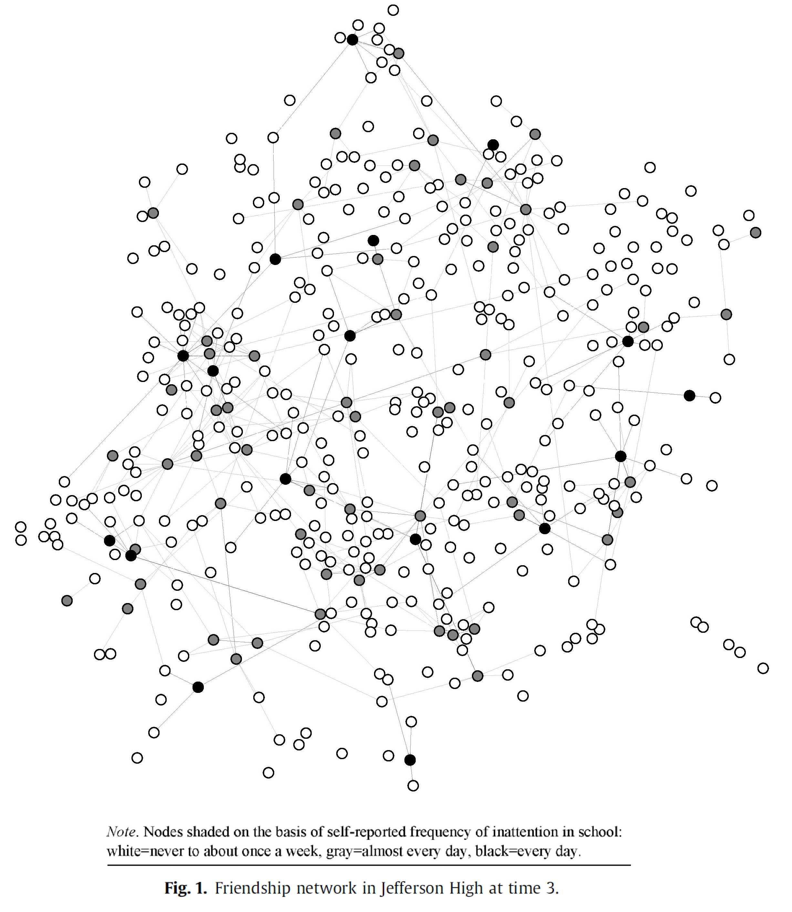

ADHD Peer Influence
=====

  

About
-----
This repository was written in 2016 and was used to publish [this paper](https://www.sciencedirect.com/science/article/abs/pii/S0277953616305093). It examines whether core ADHD diagnostic traits are subject to peer influence. With data drawn from two schools across three waves in the National
Longitudinal Survey of Adolescent Health (n ¼ 2193), I used a stochastic actor oriented model to
estimate the effect of peer influence on inattention, controlling for alternative network and behavioral
causes. Results indicated that respondents have a strong likelihood to modify their self-reports of inattention,
a core ADHD trait, to resemble that of their friends.
